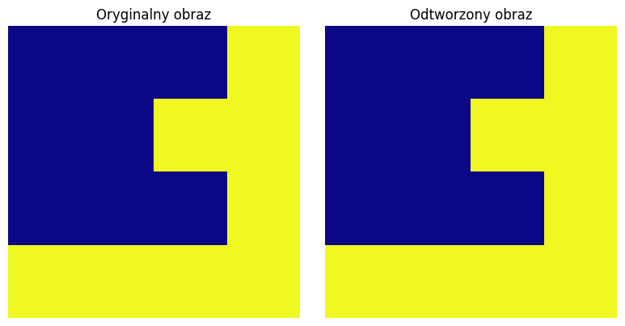

# Asymmetric Numeral Systems (ANS)

Algorytm **ANS (Asymmetric Numeral Systems)** został opracowany przez Jarosława Dudę około 2009 roku jako nowoczesna metoda kodowania entropijnego stosowana w kompresji danych. Łączy on wysoką skuteczność kompresji znaną z kodowania arytmetycznego z szybkością działania zbliżoną do kodowania Huffmana. 

## Opis (Markdown)

ANS (Asymmetric Numeral Systems) to rodzina algorytmów kodowania entropijnego
używana do bezstratnej kompresji danych.

Najważniejsze cechy:
- bardzo dobra skuteczność kompresji,
- wysoka szybkość kodowania i dekodowania,
- niskie zużycie pamięci,
- możliwość implementacji sprzętowej i programowej.

ANS działa poprzez reprezentowanie informacji jako jednej liczby całkowitej,
której stan zmienia się podczas kodowania kolejnych symboli.
Bardziej prawdopodobne symbole zwiększają stan w mniejszym stopniu niż symbole rzadkie,
co pozwala osiągać wyniki bliskie granicy entropii Shannona.

Główne warianty:
- rANS (range ANS),
- tANS (tabled ANS),
- uABS (uniform Asymmetric Binary System).

ANS jest obecnie szeroko stosowany w nowoczesnych systemach kompresji danych.

## Zastosowania

ANS znajduje zastosowanie w wielu popularnych technologiach kompresji:

* Zstandard — szybka kompresja danych używana m.in. w Linuxie i przeglądarkach,
* LZFSE — kompresja w systemach Apple,
* JPEG XL — nowoczesna kompresja obrazów,
* Google Draco — kompresja modeli 3D,
* kompresja DNA i danych bioinformatycznych,
* silniki gier i systemy streamingu danych,
* archiwizacja i przesyłanie dużych plików. 

## Ciekawostki

* ANS został zaprojektowany jako alternatywa dla kodowania Huffmana i arytmetycznego.
* W wielu przypadkach ANS osiąga kompresję bardzo bliską granicy Shannona przy znacznie mniejszym koszcie obliczeniowym.
* Wariant tANS może działać praktycznie bez mnożenia, wykorzystując tablice stanów. 
* Technologia była przedmiotem sporów patentowych z dużymi firmami technologicznymi, m.in. Google i Microsoftem. 
* ANS jest wykorzystywany w nowoczesnych standardach internetowych i systemach operacyjnych.

## Bibliografia

1. J. Duda, *Asymmetric numeral systems*, arXiv, 2009. 
2. J. Duda, *Asymmetric numeral systems: entropy coding combining speed of Huffman coding with compression rate of arithmetic coding*, arXiv, 2013. 
3. Josef Pieprzyk et al., *The Compression Optimality of Asymmetric Numeral Systems*, Entropy, 2023. 
4. Jeremy Gibbons, *Coding with Asymmetric Numeral Systems*, Oxford University, 2019. 

[1]: https://en.wikipedia.org/wiki/Asymmetric_numeral_systems "Asymmetric numeral systems"
[2]: https://arxiv.org/abs/1311.2540 "Asymmetric numeral systems: entropy coding combining speed of Huffman coding with compression rate of arithmetic coding"
[3]: https://arxiv.org/abs/0902.0271 "Asymmetric numeral systems"
[4]: https://www.mdpi.com/1099-4300/25/4/672 "The Compression Optimality of Asymmetric Numeral Systems | MDPI"
[5]: https://www.cs.ox.ac.uk/publications/publication12590-abstract.html "Department of Computer Science, University of Oxford: Publication - Coding with Asymmetric Numeral Systems"


## Przykładowe implementacje

1. rANS — kompresja tekstu
   
Idea:
Najczęściej występujące litery dostają większe prawdopodobieństwo, dzięki czemu zajmują mniej miejsca.

Przykład dla tekstu:

"AAAAABBC"

Kod — rANS dla tekstu


```python
from collections import Counter


class rANS:
    def __init__(self, text):
        counts = Counter(text)

        self.freqs = dict(counts)

        self.total = sum(counts.values())

        self.cum = {}

        c = 0
        for s, f in self.freqs.items():
            self.cum[s] = c
            c += f

    def encode(self, text):

        state = 1

        for symbol in reversed(text):

            freq = self.freqs[symbol]
            start = self.cum[symbol]

            state = (state // freq) * self.total + \
                    (state % freq) + start

        return state

    def decode(self, state, length):

        result = []

        for _ in range(length):

            x = state % self.total

            for symbol in self.freqs:

                start = self.cum[symbol]
                freq = self.freqs[symbol]

                if start <= x < start + freq:

                    result.append(symbol)

                    state = freq * (state // self.total) + \
                            (x - start)

                    break

        return ''.join(reversed(result))
```

### Przykład zastosowania


```python
text = "AAAAABBC"

coder = rANS(text)

encoded = coder.encode(text)

print("Zakodowany stan:")
print(encoded)

decoded = coder.decode(encoded, len(text))

print("\nOdkodowany tekst:")
print(decoded)
```

    Zakodowany stan:
    2626
    
    Odkodowany tekst:
    CBBAAAAA
    

2. tANS — kompresja obrazu grayscale

Idea:
Obrazy mają wiele powtarzających się pikseli.

tANS świetnie nadaje się do:

JPEG XL,
texture compression,
sprite compression,
grafiki w grach.

Kod — tANS dla obrazu:


```python
import numpy as np


class tANS:

    def __init__(self, symbols):

        self.table = symbols
        self.size = len(symbols)

    def encode(self, data):

        state = 1

        for symbol in data:

            idx = self.table.index(symbol)

            state = state * self.size + idx

        return state

    def decode(self, state, length):

        output = []

        for _ in range(length):

            idx = state % self.size

            symbol = self.table[idx]

            output.append(symbol)

            state //= self.size

        return output[::-1]
```

### Przykład zastosowania (obraz 4x4)


```python
image = np.array([
    [0, 0, 0, 255],
    [0, 0, 255, 255],
    [0, 0, 0, 255],
    [255, 255, 255, 255]
])

pixels = image.flatten().tolist()

# częstszy symbol 0
symbols = [0, 0, 0, 0, 255, 255]

coder = tANS(symbols)

encoded = coder.encode(pixels)

print("Zakodowany obraz:")
print(encoded)

decoded = coder.decode(encoded, len(pixels))

decoded_image = np.array(decoded).reshape(4, 4)

print("\nOdtworzony obraz:")
print(decoded_image)
```

    Zakodowany obraz:
    2829864072268
    
    Odtworzony obraz:
    [[  0   0   0 255]
     [  0   0 255 255]
     [  0   0   0 255]
     [255 255 255 255]]
    



Dlaczego ANS jest szybki

ANS używa:

operacji całkowitoliczbowych,
tablic lookup,
mało mnożeń,
mało pamięci cache.

Dlatego:

jest szybszy od arithmetic coding,
daje lepszą kompresję niż Huffman,
dobrze działa na CPU i GPU.

Ciekawostka matematyczna

ANS opiera się na relacji:

x' = [x/p_s] + (x mod p_s) + C_s


gdzie:

x — aktualny stan,
p_s — prawdopodobieństwo symbolu,
C_s — zakres symbolu w tablicy.
